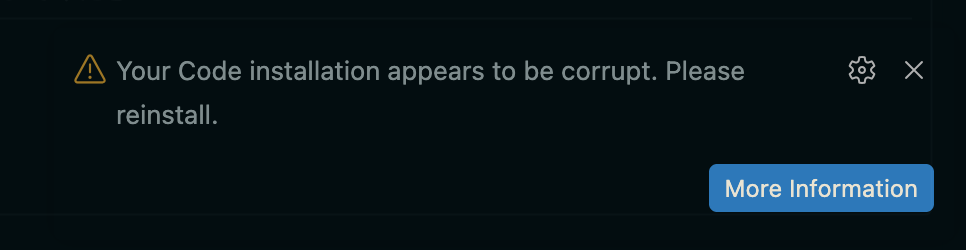

# Cursor Auto Hide

For `VSCode-Neovim` users who want the mouse cursor to **perfectly**  disappear when not in use.
Automatically hides the mouse cursor after N seconds of inactivity. Designed for **Vim / Neovim users** who navigate with the keyboard and want the cursor out of the way.

---

## Features

- 🖱️ **Auto-hides** the mouse cursor after N seconds of no movement
- ⚡ **Instant restore** — move the mouse and the cursor reappears immediately
- 🛡️ **3-layer defense** — cursor is visually hidden, hover events are suppressed, and any already-rendered hover UI is removed
- 🔒 **Safe during text selection** — dragging with the mouse won't trigger hiding mid-drag
- 🪟 **Overlay protection** — dialogs, menus, and input boxes remain fully interactive
- ⚙️ **Configurable delay** — 1 to 30 seconds

---

## Installation

### From VS Code Marketplace

Search for **"Cursor Auto Hide"** in the Extensions panel (`Ctrl+Shift+X` / `Cmd+Shift+X`), then click **Install**.

### First-time setup: "corrupt installation" warning

Because this extension patches VS Code's workbench HTML to inject the cursor-hiding logic, VS Code will show the following notification on first use:

> **Your Code installation appears to be corrupt. Please reinstall.**

**This is expected and safe.** The same warning appears with other workbench-patching extensions (Custom CSS and JS Loader, APC Customize UI++, etc.).

To suppress it permanently:

1. Click the **⚙️ gear icon** on the notification
2. Select **"Don't Show Again"**

You only need to do this once per VS Code version. After a VS Code update the warning may reappear — dismiss it the same way.

After first install, VS Code will ask you to **Quit and restart** once to activate the cursor hiding.

---

## Settings

|         Setting          | Default |                     Description                      |
| ------------------------ | ------- | ---------------------------------------------------- |
| `cursorAutoHide.enabled` | `true`  | Enable / disable cursor auto-hiding                  |
| `cursorAutoHide.delay`   | `3`     | Seconds of inactivity before the cursor hides (1–30) |

### Changing the delay

1. Open Settings (`Ctrl+,` / `Cmd+,`)
2. Search for **"Cursor Auto Hide"**
3. Change **Delay** to your preferred value
4. Click **"Reload Now"** on the notification that appears

> Changing the delay only updates a small config file — no full restart required.

---

## How it works

The extension injects a `<style>` block and a small JavaScript file into VS Code's workbench HTML. Three CSS/JS layers work together to ensure a clean hide:

| Layer |             Technique             |                Purpose                |
| ----- | --------------------------------- | ------------------------------------- |
| 1     | `cursor: none !important`         | Visually hides the cursor             |
| 2     | `pointer-events: none !important` | Prevents new hover UI from triggering |
| 3     | `display: none` on hover widgets  | Removes already-rendered hover UI     |

Moving the mouse instantly removes all three layers so VS Code behaves completely normally.

---

## Uninstalling

1. Disable or uninstall the extension in the Extensions panel
2. A **"Quit VS Code"** prompt will appear — quit and restart to fully restore VS Code's original workbench HTML

---

## Known limitations

> [!WARNING]
> This extension requires local access to VS Code's workbench HTML file. The following environments are **not supported**:
> - **VS Code for the Web** — vscode.dev, GitHub Codespaces (browser)
> - **Remote - SSH** — the workbench HTML resides on the local client, not the remote host, so the extension cannot locate it and will show a warning notification

- **VS Code update warning** — after a VS Code version update, the "corrupt installation" notification may reappear. Dismiss it with ⚙️ → "Don't Show Again" as described above

---

## Requirements

- VS Code 1.85.0 or later
- macOS, Linux, or Windows (desktop install)

---

## License

MIT — see [LICENSE](LICENSE)
